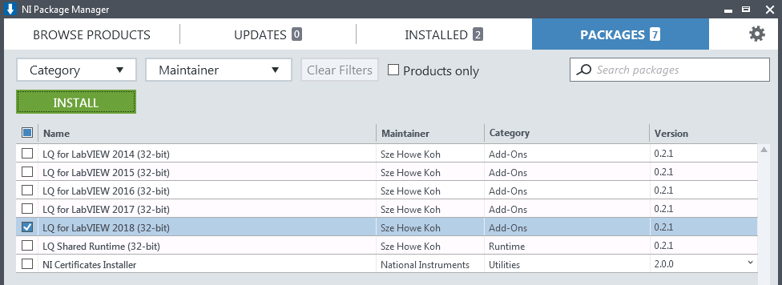
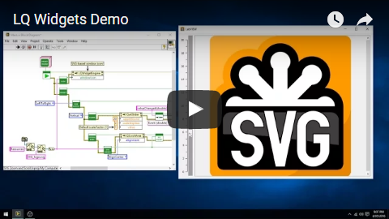

LQ
==
LQ (pronounced "Luke") is a set of [LabVIEW](https://www.ni.com/labview/)
bindings for the [Qt toolkit](https://www.qt.io/). It lets LabVIEW programmers
create dynamic, flexible, and powerful GUIs.

LQ is currently focussed on the widget classes, but other major technologies
from Qt are planned for inclusion in future releases.

Supported Platforms
-------------------
Development Platforms
* LabVIEW 2016 or newer (32-bit and 64-bit)

Deployment Platforms
* Windows (as supported by LabVIEW)
* NI Linux RT 19.0 or newer

Installation
------------
First, add the LQ feed (_**https://jksh.github.io/LQ-Bindings/feeds/win_x86/**_)
to NI Package Manager (NIPM):  

Then, install the LQ package:  

For step-by-step instructions, read the [Quickstart guide](https://jksh.github.io/LQ-Bindings/docs/).
The guide also links to alternative installation methods that don't require NIPM.

Examples
--------
Open LabVIEW, then open the NI Example Finder (**Help > Find Examples...**) and
search for the keywords "_LQ_" or "_Qt_".  

Here is a video compilation of some of the examples:  

Usage
-----
Copy example code into your own block diagram and modify it.

If a class has already been loaded into LabVIEW's memory, it is accessible via
the Quick Drop menu. Otherwise, drag it from Windows Explorer onto your block
diagram (from _vi.lib\addons\LQ\\_).

NOTE: LabVIEW palette entries are planned for future releases.

Known Issues
------------
This is a pre-alpha release, which means (i) the API will likely change in the
near future, (ii) the library is far from feature-complete, (iii) performance is
not optimized, and (iv) you might experience crashes. Other issues include:

* You currently can't free any resources or disconnect signals, except by
  calling _LQCoreEngine.lvclass:Stop Engine.vi_.

* QWinThumbnailToolButton cannot be applied to non-Qt windows, such as LabVIEW
  front panels.

* After you start and stop the engine, QWinThumbnailToolButton no longer emits
  any signals when you click on it.
    * Workaround: Restart LabVIEW.

* There are a few small memory leaks, which will persist until you close
  LabVIEW.

Roadmap
-------
See http://github.com/JKSH/LQ-Bindings/wiki/Roadmap

License
-------
Copyright (c) 2021 Sze Howe Koh <<szehowe.koh@gmail.com>>

The LQ library is published under the [Mozilla Public License v2.0](LICENSE.MPLv2),
while examples are published under the [MIT License](examples/LICENSE.MIT).

LQ also uses third party software that are licensed under different terms.
Please see the [3rdparty](3rdparty) folder for details.
