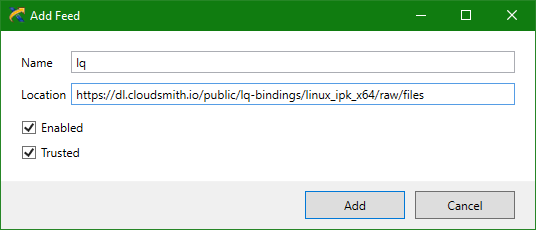
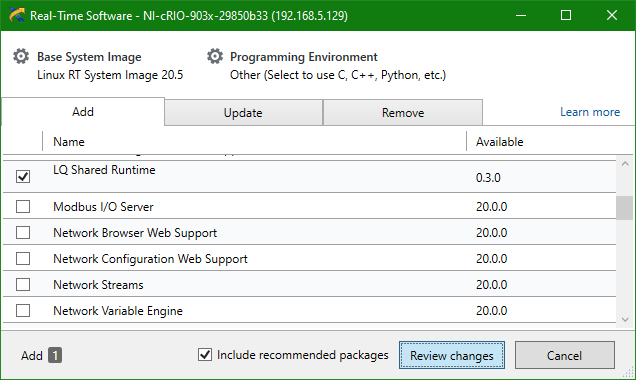
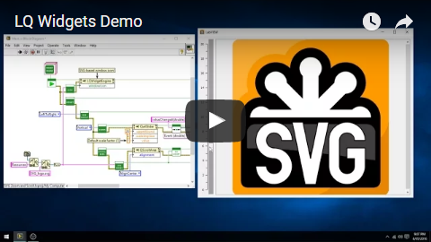

LQ
==
LQ (pronounced "Luke") is a set of [LabVIEW](https://www.ni.com/labview/)
bindings for the [Qt toolkit](https://www.qt.io/). It lets LabVIEW programmers
create dynamic, flexible, and powerful GUIs.

LQ is currently focussed on the widget classes, but other major technologies
from Qt are planned for inclusion in future releases.

Supported Platforms
-------------------
Development Platforms
* LabVIEW 2016 or newer (32-bit and 64-bit)

Deployment Platforms
* Windows (as supported by LabVIEW)
* NI Linux RT 19.0 or newer (x64)

Installation on Windows
-----------------------
First, add the LQ feed to NI Package Manager (NIPM):
* _**https://jksh.github.io/LQ-Bindings/feeds/win_x86/**_ or
* _**https://jksh.github.io/LQ-Bindings/feeds/win_x64/**_
 

Then, install the LQ package:  

For step-by-step instructions, read the [Windows setup guide](https://jksh.github.io/LQ-Bindings/setup-win.html).

Installation on NI Linux RT
---------------------------
First, add the LQ feed via NI Measurement & Automation Explorer (NI MAX):
* _**https://dl.cloudsmith.io/public/lq-bindings/linux_ipk_x64/raw/files**_ 
 

Then, install the LQ package:  

For step-by-step instructions, read the [NI Linux RT setup guide](https://jksh.github.io/LQ-Bindings/setup-nilrt.html).

Examples
--------
Open LabVIEW, then open the NI Example Finder (**Help > Find Examples...**) and
search for the keywords "_LQ_" or "_Qt_".  

Here is a video compilation of some of the examples:  

Usage
-----
Copy example code into your own block diagram and modify it.

If a class has already been loaded into LabVIEW's memory, it is accessible via
the Quick Drop menu. Otherwise, drag it from Windows Explorer onto your block
diagram (from _vi.lib\addons\LQ\\_).

NOTE: LabVIEW palette entries are planned for future releases.

Known Issues
------------
This is a pre-alpha release, which means (i) the API will likely change in the
near future, (ii) the library is far from feature-complete, (iii) performance is
not optimized, and (iv) you might experience crashes. Other issues include:

* You currently can't disconnect signals, except by calling
  _LQCoreEngine.lvclass:Stop Engine.vi_.

* QWinThumbnailToolButton cannot be applied to non-Qt windows, such as LabVIEW
  front panels.

Roadmap
-------
See http://github.com/JKSH/LQ-Bindings/wiki/Roadmap

License
-------
Copyright (c) 2022 Sze Howe Koh <<szehowe.koh@gmail.com>>

The LQ library is published under the [Mozilla Public License v2.0](LICENSE.MPLv2),
while examples are published under the [MIT License](examples/LICENSE.MIT).

LQ provides bindings to third party libraries that are licensed under different terms.
Please see the [3rdparty](3rdparty) folder for details.

Acknowledgements
----------------
Package repository hosting is graciously provided by  [Cloudsmith](https://cloudsmith.com).
Cloudsmith is the only fully hosted, cloud-native, universal package management solution, that
enables your organization to create, store and share packages in any format, to any place, with total
confidence.
