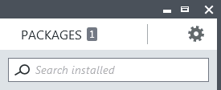
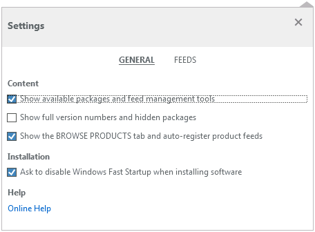
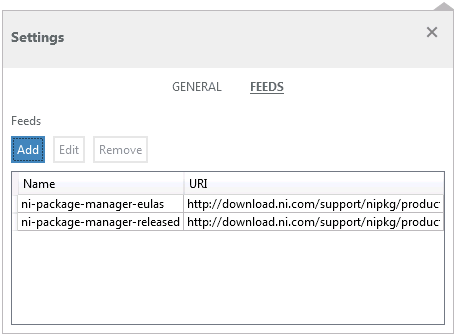
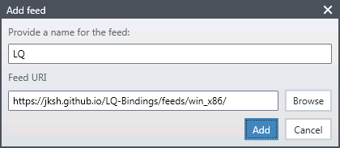
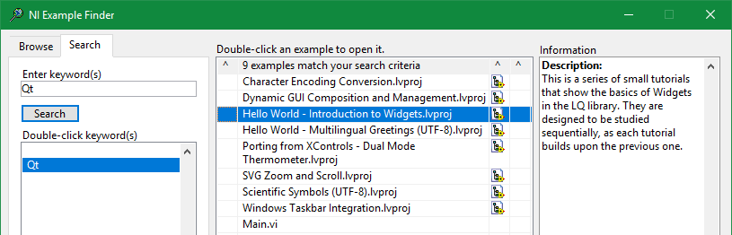

LQ lets LabVIEW programmers create dynamic, flexible, and powerful GUIs by harnessing the Qt
toolkit.

If you already have NI Package Manager (NIPM), follow the quickstart guide below. Otherwise, see
the [detailed installation](installation.html) page for alternative methods.

Instructions
------------
1. Open NIPM and click the **Settings** icon.  
   

2. Enable the option, _"Show available packages and feed management tools"_.  
   
   
3. Switch to **Settings > Feeds** and click **Add**.  
   

4. Enter _**https://jksh.github.io/LQ-Bindings/feeds/win_x86/**_ as the feed URI. Enter "LQ" as the
   feed name.  
   

5. Switch to the **Packages** tab and install LQ for your version(s) of LabVIEW.  
   

6. Open LabVIEW, then open the NI Example Finder (**Help > Find Examples...**) and search for the keywords
   "_LQ_" or "_Qt_".  
   

7. Open an example project, run it, and study its code.
