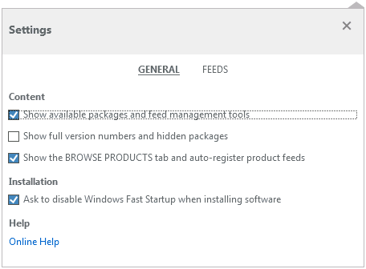
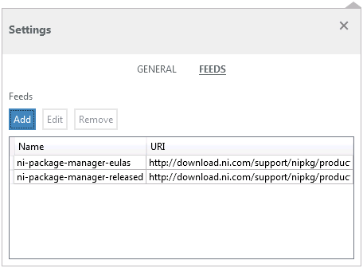
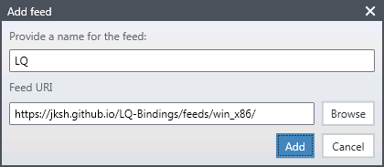
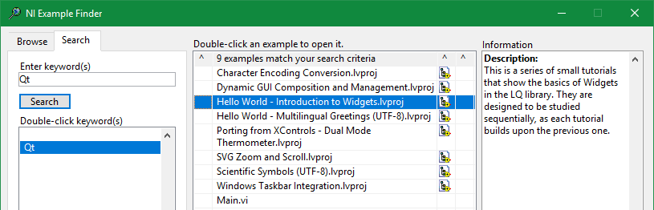

LQ lets LabVIEW programmers create dynamic, flexible, and powerful GUIs by harnessing the Qt
toolkit.

The recommended way to install LQ on Windows is via
[NI Package Manager](https://www.ni.com/en-us/support/downloads/ni-package-manager.html) (NIPM).

Recommended Installation
------------------------
1. Open NIPM and click the **Settings** icon.  
   

2. Enable the option, _"Show available packages and feed management tools"_.  
   
   
3. Switch to **Settings > Feeds** and click **Add**.  
   

4. Enter "LQ" as the feed name. Enter the feed URI that corresponds to your LabVIEW installation's bitness:
    * _**https://jksh.github.io/LQ-Bindings/feeds/win_x86/**_ or
    * _**https://jksh.github.io/LQ-Bindings/feeds/win_x64/**_
   

5. Switch to the **Packages** tab and install LQ for your version(s) of LabVIEW.  
   

6. Open LabVIEW, then open the NI Example Finder (**Help > Find Examples...**) and search for the keywords
   "_LQ_" or "_Qt_".  
   

7. Open an example project, run it, and study its code.

Alternative Installation
------------------------
If you cannot use NIPM, then download the *.zip files from
[https://github.com/JKSH/LQ-Bindings/releases](https://github.com/JKSH/LQ-Bindings/releases)
and manually extract their contents into their destinations:

* _lq-dev*.zip_ goes into your LabVIEW installation folder (for example,
  _C:\Program Files (x86)\National Instruments\LabVIEW 2016\\_)
* _lq-runtime*.zip_ goes into the Program Files folder (for example, _C:\Program Files (x86)\\_)
