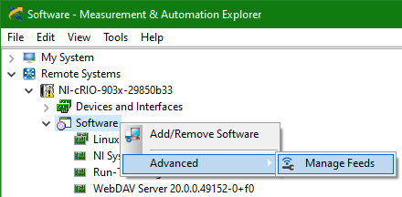
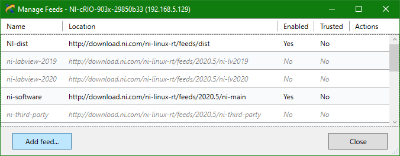
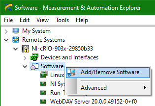
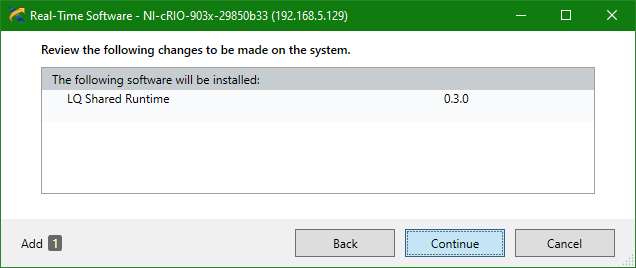
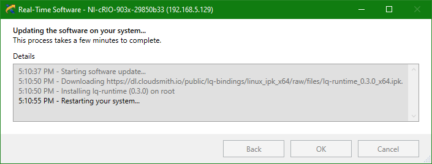

Recommended Setup Method
------------------------

Use the [NI Measurement & Automation Explorer](https://knowledge.ni.com/KnowledgeArticleDetails?id=kA03q000000YGQwCAO)
(NI MAX) to set up the feed and install the LQ package on your NI Linux RT device.

1. Open NI MAX and find your device under **Remote Systems**. Right-click **Software** and select
   **Advanced > Manage Feeds**.  
   

2. Click **Add feed...**  
   
   
3. Enter the feed details, and then click **Add**:
     * Name: _lq_
	 * Location: _**https://dl.cloudsmith.io/public/lq-bindings/linux_ipk_x64/raw/files**_
	 * Enabled: ✓
	 * Trusted: ✓

   

4. Right-click **Software** and select **Add/Remove Software**.  
   

5. Select "LQ Shared Runtime" and click **Review changes**.  
   

6. Confirm the change and click **Continue** to finish the installation.   
     
   

Advanced Setup Methods
----------------------

Aside from NI MAX, there are other ways to install LQ on your device. Choose one of the following.

### Installation using opkg (Online)

1. Download _[lq.conf](assets/config/lq.conf)_ and save it to _/etc/opkg/lq.conf_ on your NI Linux
   RT device. It is simply a text file that contains a single line:  
     `src/gz lq https://dl.cloudsmith.io/public/lq/linux_ipk_x64/raw/files [trusted=yes]`

2. While logged in as "admin" via SSH, run the following commands from the console:  
     `opkg update`  
	 `opkg install lq-runtime`

### Installation using opkg (Offline)

1. Download _lq-runtime_0.4.0_x64.ipk_ from
   [https://github.com/JKSH/LQ-Bindings/releases](https://github.com/JKSH/LQ-Bindings/releases) and
   transfer it to your NI Linux RT device.

2. While logged in as "admin" via SSH, `cd` into the directory that contains the .ipk and run this
   command from the console:  
     `opkg install lq-runtime_0.4.0_x64.ipk`

### Installation via SystemLink

If your NI Linux RT device is managed under [NI SystemLink](https://www.ni.com/systemlink), you can
also use the [Systems Management](https://www.ni.com/documentation/en/systemlink/latest/manager/managing-systems/)
web app to set up the feed and install the LQ package.
